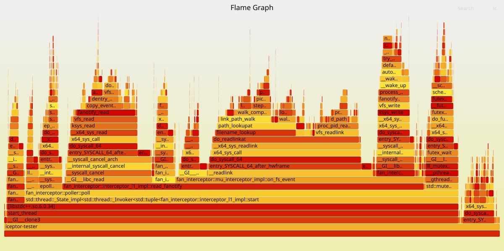

# Layered fanotify interceptor

Fanotify subsystem is a Linux kernel module providing events to user-space from filesystem activity
like opening, accesing, modifying and closing files. Some of the events are permissive synchronous
ones requiring that fanotify user-space client must directly answer on the event with allow / deny
verdict.

The library implements two-layer fanotify interceptor for tracking file access / modify in
Linux-family operation systems. The first layer implements the interceptor itself by organizing
reading loop on fanotify file descriptor, managing fanotify modes and scopes of file system
tracking. The second layer implements multi-user support allowing different subscribers to have
different requirements on what should be tracked. It also contains a cache of verdicts allowing to
have a fast track for permissive events for those filesystem objects which are not modified.

The library interface is located in src/interceptor_types.h. The layer 1 is represented by
`interceptor_l1` type. It's client is assumed to be represented by `interceptor_l1::l1_client` type.
The layer implementation can be used as a standalone component providing basic functionality.

The layer 2 is represented by `mu_interceptor` type. It has typical subscribe/unsubscribe pattern
allowing different users to get only needed subset of filesystem events including permissive ones. A
client code is assumed to be behind `mu_subscriber` type.

A trivial library tester is implemented in iceptor-tester.cpp file. Take a look on it as a sample of
library usage. Most of the library methods are documented in place.

# Notes about performance

Typical fanotify usage scenario includes next steps involving kernel-space <-> user-space walking:

1. waiting for an event by calling e.g. `epoll()`
2. reading the event by calling `read()`
3. reading a path to the FS object by calling `readlink()` (if you plan to implement at least trivial
FS filtering)
4. writing an answer for a permission check event by calling `write()`
5. closing a file descriptor opened for us by Fanotify subsystem

All these steps are not for free. They form a chain of time devourers participating in a sequence of
actions the kernel must pass before allowing external process to make desired action on FS object
in question. Except (5), precisely speaking. Thus even trivial opening a file on my machine
increases roughly from 2us to 20us.

